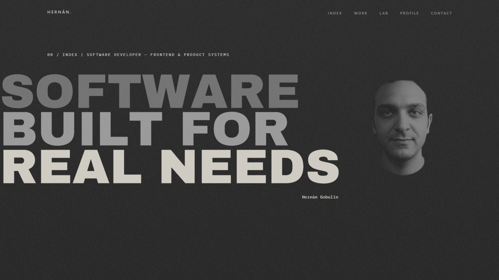

# Hernán Gobulin — Software Developer

### Frontend & Product Systems

I build digital products, interfaces and systems around real operational needs — combining frontend development, product thinking and practical implementation.

**Live portfolio:** [hernangobulin.com](https://hernangobulin.com)



## About this portfolio

This portfolio was designed and developed as a product in itself: not only to showcase finished websites, but to explain the systems, decisions and real-world problems behind my work.

The experience is organized around two main areas:

- **Selected Work** — production projects, digital platforms and systems developed for real organizations, businesses and operational contexts.
- **LAB** — products, prototypes and technical explorations where I investigate ideas, architecture, interfaces and new ways of solving problems.

The product defines the stack — technology is selected according to the problem, context and constraints rather than forcing every project into the same solution.

## Tech Stack

**Core**

- React
- TypeScript
- Vite
- Tailwind CSS

**Development & quality**

- ESLint
- Prettier
- Git / GitHub
- Responsive development
- Accessibility-aware interactions

## Engineering & Product Decisions

Some of the principles behind the implementation:

- Component-based architecture with reusable UI patterns.
- Project content separated from presentation logic.
- Responsive layouts designed across mobile, tablet and desktop.
- Keyboard navigation and visible focus states.
- Reduced-motion support for users who prefer less animation.
- Optimized visual assets and production builds.
- Interactive elements designed to support the narrative instead of functioning as decoration alone.

## Portfolio Structure

```text
src/
├── assets/       # Images, logos and visual resources
├── components/   # Reusable UI and interaction components
├── data/         # Structured project content
├── pages/        # Page-level composition
├── sections/     # Main portfolio sections
├── App.tsx
├── index.css
└── main.tsx
```

The main experience is divided into:

- **Index** — professional positioning and introduction.
- **Work** — selected production work and real-world implementations.
- **LAB** — systems, prototypes and product explorations.
- **Profile** — technologies, tools and professional approach.
- **Contact** — direct communication channels.

## Run Locally

Clone the repository and install the dependencies:

```bash
npm install
```

Start the development server:

```bash
npm run dev
```

Create a production build:

```bash
npm run build
```

Run the linter:

```bash
npm run lint
```

Preview the production build locally:

```bash
npm run preview
```

## Project Status

**Active / Production portfolio**

The portfolio continues to evolve as new products, experiments and professional work are developed.

→ [View the live portfolio](https://hernangobulin.com)
